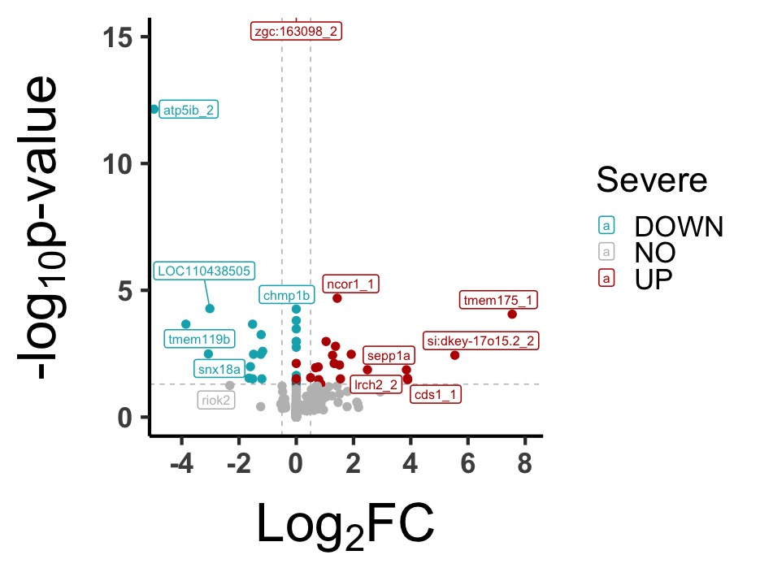
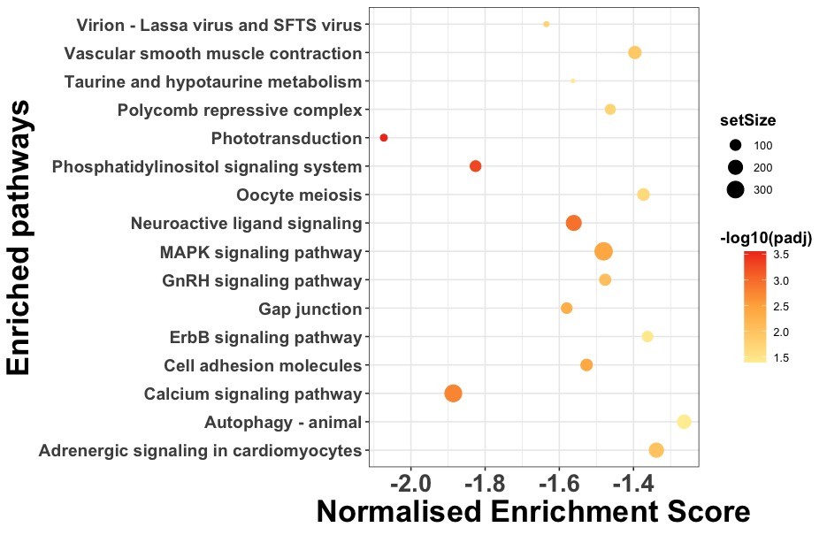

# Trascriptomic Profile of Mn overloaded Zerbafish Brain
End-to-end bulk RNA-seq pipeline from experimental design, RNA sample collection, and analysis pipeline, including raw FASTQ files QC to differential gene expression, GO term, and Pathway analysis.

<!-- Optional badges -->
<!--
[](LICENSE)
[]()
[]()
-->

---

## ✨ Features

- ✅ DE(allGenes Table, significant genes) →VolcanoPplot->

- ✅ Gene Set Enrichment Analysis (GO-Analysis) and Dot Plot visualisation

- ✅ KEGG Pathways Analysis and Visualisation

---

## 📁 Project structure

Brief description of the main folders / files.

```text
PROJECT_NAME/
├─ data/              countMatrix and SampleInformation
├─ results/           Differential geneExpression list, volcanoPlots
├─ src/               #ore R code
├─ notebooks/         # Exploratory analyses / reports (Rmd, qmd, ipynb)
├─ config/            # Config files (YAML/JSON) for parameters, paths, etc.
├─ env/               # Conda environment or requirements files
└─ README.md          # Thisile

---
# Example of Plots


